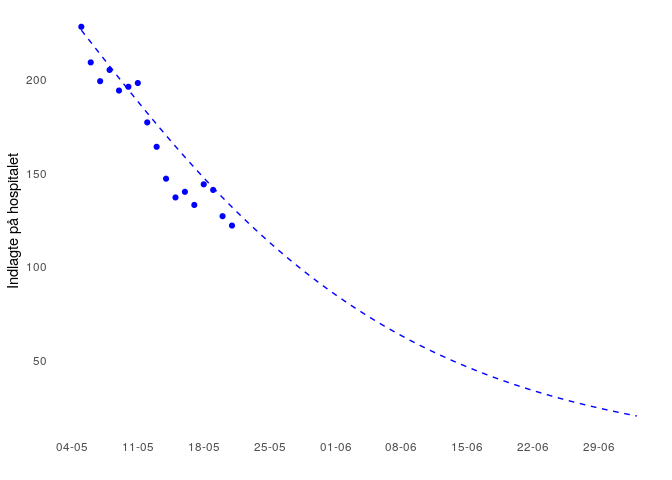

<!-- README.md is generated from README.Rmd. Please edit that file -->

# Sådan forudsiger du Corona i Danmark

<!-- badges: start -->

<!-- badges: end -->

Målet med dette repository er at vise dig, hvordan du kan forudsige
Corona i Danmark. Jeg vil over de næste par sætninger vise dig noget
kode, der gør dig i stand til selv forudsige udviklingen af Corona i
Danmark.

Det er vigtigt med åbenhed og gennemsigtighed i en krise. Derfor lægger
jeg nu dette kode frem. Det er open source og anvender selv udelukkende
open source programmer og kode, så alle kan efterprøve koden. Jeg synes
ærligt talt det har manglet med åbenhed omkring koden for
Corona-beregninger i Danmark.

Med disse beregninger gør jeg det bedste jeg kan. Jeg har ikke adgang
til sundhedsmyndighedernes data og baserer derfor dette på de data, der
er offentligt tilgængeligt. Jeg vælger også forskellige parametre
undervejs i mine beregninger som myndigheder evt. ville sætte
anderledes. Men jeg går det åbent og lægger alt min kode frem, så du kan
se, hvordan jeg gør.

Du må meget gerne hjælpe mig med at forbedre koden, hvis der er ting du
mener jeg har gjort forkert eller kunne forbedre. Hvis du kender GIT kan
du forke dette repo og lave en merge request. Og hvis det jeg lige skrev
var sort snak, så er du velkommen til at skrive til mig på min email
<mikkelkrogsholm@gmail.com>.

-----

#### Infrastrukturen

Jeg kører koden i en docker container. Nærmere betegnet
[rocker/tidyverse:3.6.1](https://hub.docker.com/r/rocker/tidyverse). Det
kan du også hvis du vil være sikker på at have præcis de samme
pakkeinstallationer som mig.

-----

#### Bibliotekerne (libraries)

Det første vi skal gøre er at loade de biblioteker/pakker vi skal bruge
til at forudsige Corona i Danmark.

``` r
library(tidyverse)
library(EpiEstim)
library(deSolve)
```

Vi bruger `tidyverse` suiten af pakker til generel datahåndtering og
datamanipulation. `EpiEstim` bruger vi til at estimere smittetallet R
med, og `deSolve` bruger vi til at udregne de ligninger vi skal bruge
for at forudsige Corona i Danmark.

#### Sær-funktioner

Jeg skal bruge nogle sær-funktioner undervejs. Det vil sige funktioner,
der ikke allerede findes i R (programmeringssproget), men som jeg
definerer på forhånd.

Jeg skal bruge en funktion, der kan lave rullende gennemsnit, den kalder
jeg for `rollmean` og jeg laver en function, der kan skabe en normal
fordelt kurve mellem to værdier, den kalder jeg `rnorm.between` (koden
til den er lånt fra et sted på nettet).

``` r
rollmean <- function(x, k){
  
  if(k %% 2 != 1){stop("k must be uneven")}
  
  na_pad <- rep(NA, floor(k/2))
  
  out <- c(na_pad,
           zoo::rollmean(x = x, k = 5), 
           na_pad)

  out
}


rnorm.between <- function(n, minimum = 0, maximum = 1) {
  x <- rnorm(n)
  max_x <- max(x)
  min_x <- min(x)
  x <- x - min_x
  x <- x / (max_x - min_x)
  x <- x * (maximum - minimum)
  x <- x + minimum
  
  return(x)
}
```

#### Corona data

For at have noget data at arbejde med, så henter jeg data fra
<https://api.covid19data.dk>, der er et API jeg har skabt, der løbende
indeholder de tal myndighederne udgiver i deres daglige rapporter.

Der er to datasæt vi er interesserede i:

1)  det er datasættet for nyindlæggelser som vi skal bruge til at
    udregne smittetrykket (R) med.
2)  de reelle indlæggelses tal, som vi skal bruge både som inputværdier
    til vores ligninger senere men også til at verificere dem med.

På begge datasæt laver jeg et rullende gennemsnit på fem dage. Det vil
sige at en dato får gennemsnittet af sig selv, de to foregående dage,
samt de to efterfølgende.

``` r
# Get newly hospitalized
url_newly <- "https://api.covid19data.dk/ssi_newly_hospitalized"

newly_raw <- jsonlite::fromJSON(url_newly) %>%
  as_tibble() %>%
  mutate(date = date %>% lubridate::ymd_hms() %>% as.Date())

newly <- newly_raw %>% 
  slice(1:(n() - 4)) %>%
  mutate(rollingmean = rollmean(newly_hospitalized, 5)) %>%
  drop_na()

# Show first three and last three rows
newly %>% slice(1:3,((n()-2):n()))
#> # A tibble: 6 x 3
#>   date       newly_hospitalized rollingmean
#>   <date>                  <int>       <dbl>
#> 1 2020-02-27                  0         0  
#> 2 2020-02-28                  0         0.2
#> 3 2020-02-29                  0         0.2
#> 4 2020-05-03                 13        14.4
#> 5 2020-05-04                 11        12.4
#> 6 2020-05-05                 12        10.8
```

``` r
# Get current total hospitalized
url_hosp <- "https://api.covid19data.dk/ssi_hospitalized"

hosp_raw <- jsonlite::fromJSON(url_hosp)

hosp <- hosp_raw %>% 
  mutate(timestamp = timestamp %>% lubridate::ymd_hm(),
         date = timestamp %>% as.Date()) %>%
  group_by(date) %>%
  summarise_at(c("hospitalized", "critical", "respirator"), sum, na.rm  = TRUE) %>%
  mutate(hospitalized_rm = rollmean(hospitalized, 5),
         critical_rm = rollmean(critical, 5),
         respirator_rm = rollmean(respirator, 5)) %>%
  drop_na()

# Show first three and last three rows
hosp %>% slice(1:3,((n()-2):n()))
#> # A tibble: 6 x 7
#>   date       hospitalized critical respirator hospitalized_rm critical_rm
#>   <date>            <int>    <int>      <int>           <dbl>       <dbl>
#> 1 2020-03-19          153       30         27            151.        30.2
#> 2 2020-03-20          186       37         32            181.        35.8
#> 3 2020-03-21          206       42         33            206.        42  
#> 4 2020-05-08          205       42         35            201.        42  
#> 5 2020-05-09          194       39         32            198.        41.4
#> 6 2020-05-10          196       40         33            194         41.4
#> # … with 1 more variable: respirator_rm <dbl>
```

#### Forudsig smittetrykket

Nu er vi klar til at forudsige smittetrykket - også kaldet R.

Jeg har lånt dette tekst om R fra Statens Serum Institut:

> BAGGRUND: OM R

> En infektionssygdoms spredningsevne kan udtrykkes med det såkaldte
> reproduktionstal R. Tallet kaldes også smittetrykket, smittetallet
> eller kontakttallet. R beskriver, hvor mange personer en smittet
> person i gennemsnit vil smitte.

> R kan ændres over tid, og kan derfor kaldes Rt. I starten af en
> epidemi, hvor alle er modtagelige refereres til R0. Det kaldes det
> basale reproduktionstal og viser, hvor smitsom sygdommen er i en
> delvis kunstig situation, hvor personer hele tiden blander sig frit
> med hverandre, og dermed kan blive udsat for smitte.

> Senere i epidemien anvender man ofte Re eller Rt (det effektive
> reproduktionstal). Her kan der være opstået en vis immunitet i
> befolkningen eller, der kan være lavet kontrolforanstaltninger,
> hvorved Re kan være mindre end R0. Det er altså et mål for, hvor
> smitsom en sygdom faktisk er, i en given sammenhæng.

> R er afhængig af antallet af kontakter, risikoen for overførsel af
> smitte ved hver kontakt samt varigheden af den smitsomme periode.
> Disse faktorer kan påvirkes ved forskellige smitteforanstaltninger. Er
> R \< 1 vil epidemien efterhånden uddø. Ved R \> 1 vil epidemien vokse.
> R kan således give en indikation på, hvor man er på smittekurven dvs.
> om den er accelererende (\>1) eller nedadgående (\<1). R beskriver
> derimod ikke, hvor man er på kurven i forhold til kapaciteten i
> sundhedsvæsenet og kan derfor ikke bruges som et mål i sig selv eller
> som et styringsredskab for beredskabet.

Kilde:
[SSI](https://files.ssi.dk/Status%20for%20smittetrykket%20i%20Danmark%20290420-nw20)

Jeg bruger pakken `EpiEstim` til at forudsige smittetrykket. Den skal
fodres med forskellige parametre:

1)  en tidsserie med smittede. I dette tilfælde er det det rullende
    gennemsnit fra ny indlæggelserne.
2)  nogle data omkring serie intervallet (hvor længe der er i tid mellem
    de smittede). Her sætter jeg `mean_si` til 4.7, da det er det samme
    som SSI gør, og `std_si` sætter jeg til 2.9. Jeg ved ikke hvad SSI
    bruger der.

<!-- end list -->

``` r
confirmed_cases <- newly %>% select(I = rollingmean)

R_estim <- estimate_R(confirmed_cases, 
                     method = "parametric_si", 
                     config = make_config(list(mean_si = 4.7, 
                                               std_si = 2.9)))

# Print oout the R table for inspection
R_estim$R %>%  as_tibble()
#> # A tibble: 62 x 11
#>    t_start t_end `Mean(R)` `Std(R)` `Quantile.0.025… `Quantile.0.05(…
#>      <dbl> <dbl>     <dbl>    <dbl>            <dbl>            <dbl>
#>  1       2     8      4.71    2.07              1.57             1.90
#>  2       3     9      4.03    1.57              1.57             1.84
#>  3       4    10      4.17    1.33              1.98             2.24
#>  4       5    11      4.67    1.18              2.65             2.91
#>  5       6    12      4.57    0.962             2.89             3.11
#>  6       7    13      4.39    0.765             3.02             3.22
#>  7       8    14      4.17    0.606             3.06             3.22
#>  8       9    15      3.82    0.476             2.94             3.07
#>  9      10    16      3.45    0.375             2.75             2.86
#> 10      11    17      3.17    0.302             2.61             2.69
#> # … with 52 more rows, and 5 more variables: `Quantile.0.25(R)` <dbl>,
#> #   `Median(R)` <dbl>, `Quantile.0.75(R)` <dbl>, `Quantile.0.95(R)` <dbl>,
#> #   `Quantile.0.975(R)` <dbl>
```

Som du kan se viser den R-tallet samt en rækker usikkerheds intervaller.
Det er nemmere at se grafisk, så derfor plotter jeg det så vi kan set
det som en figur. Jeg zoomer ind på den del af figuren, der ligger efter
2020-03-20, da det giver en bedre visuel fremstilling.

``` r
pd <- R_estim$R %>% 
  as_tibble() %>% 
  select(t = t_end, 
         R = `Mean(R)`, 
         lower = `Quantile.0.05(R)`, 
         upper = `Quantile.0.95(R)`) %>%
  mutate(t = (t-1) + min(newly$date))

anno <- pd %>% slice(n())

pd %>%
  filter(t >= "2020-03-20") %>%
  ggplot() + 
  geom_ribbon(aes(x = t, ymin = lower, ymax = upper), fill = "lightgrey") + 
  geom_line(aes(x = t, y = R)) + 
  geom_hline(yintercept = 1, linetype = "dashed") + 
  geom_label(data = anno, aes(x = t, y = R, label = round(R, 2))) +
  theme_minimal() + 
  labs(x = "", y = "Effektiv reproduktionstal") + 
  scale_x_date(breaks = "weeks", labels = scales::date_format("%d-%m")) 
```

<!-- -->

Som du kan se, så ser smittetrykket ud til nu at være 0.76 (0.64 ;
0.89). Det er det smittetryk vi kan bruge til at fremskrive de danske
Corona tal med og derved lave en forudsigelse.

#### SIR modellen

Jeg bruger en såkaldt [SIR
model](https://en.wikipedia.org/wiki/Compartmental_models_in_epidemiology)
til mine forudsigelser. Det er populært sagt en kasse-model, hvor jeg
flytter folk fra den ene kasse til den anden. Jeg flytter fx folk fra en
“modtagelig” kasse over i en “syg” kasse, når folk bliver smittede og
begynder at vise symptomer.

I min forudsigelse her er jeg i princippet kun interesset
hospitaliseringstallet. Det vil sige hvor mange, der kommer på
hospitalet. Det skyldes at det er det mest reelle tal vi har, og derfor
det bedste at basere modellen på og evaluere den på.

Der er 4 kasser i min model:

1)  S: Susceptible eller modtagelige på dansk
2)  I: Infected eller inficerede på dansk
3)  H: Hospitalized eller indlagte på dansk
4)  R: Removed eller fjernede på dansk. Disse er enten raske eller døde.

I standard modeller bruger man ord som beta og gamma til at beskrive de
forskellige rater som folk flytter mellem kasser på. Jeg har valgt at
kalde dem nogle lidt andre ting, men principperne er de samme.

Her kan I se, hvordan jeg har defineret den function vi skal bruge:

``` r
sir_ode <- function(times, init, parms){
  
  with(as.list(c(parms, init)), {
    
    # ODEs
    
    dSdt = -S2I * S * I / N
    
    dIdt = S2I * S * I / N - (1 - Hpct) * I2R * I - I2H * I * Hpct
    
    dHdt = I2H * I * Hpct - H * H2R
    
    dRdt = (1 - Hpct) * I2R * I + H * H2R
    
    list(c(dSdt, dIdt, dHdt, dRdt))
  })
}
 
```

De forskellige modelinputs bliver forklaret nu.

#### Modelparametre og input

Vores SIR-model skal have nogle parametre og nogle inputs for at virke.
Parametrene er de værdier den skal bruge til at udregne for mange, der
skal flytte mellem hver af kasserne og inputs er de startværdier som,
der er i hver kasse.

##### Parametre

``` r
# Defining R0
R_0 = anno$R

# Setting the parms
days2hosp = 8
I2H = 1 / days2hosp
Hpct = .02
I2R = 1 / 5
S2I = R_0 * I2R
H2R = 1 / 15
```

`days2hosp` er dage fra sygdom til indlæggelse. Den sætter jeg til 8
baseret på de tal myndighederne selv bruger i deres fremlagte [Shiny
app](https://kagr.shinyapps.io/C19DK/).

`I2H` er raten folk bliver flyttet med fra I til H kassen. Den er 1 over
dagene, altså 1/8.

`Hpct` er hvor stor en andel af de inficerede der ryger på hospitalet.
Den sætter jeg til 2% baseret på et skøn ud fra de tal myndighederne
selv bruger i deres fremlagte [Shiny
app](https://kagr.shinyapps.io/C19DK/).

`I2R` er raten folk bliver flyttet med fra I til R kassen. Det vil sige
den rate folk bliver raske i. Det tager ca. 5 dage at blive rask, så den
sætter jeg til 1/5. 5 er baseret på de tal myndighederne selv bruger i
deres fremlagte [Shiny app](https://kagr.shinyapps.io/C19DK/).

`S2I` er raten folk bliver flyttet med fra S til I kassen. Altså hvor
mange, der bliver smittede hver dag. Da det er syge, der smitter, så
skal de nå at smitte inden de bliver raske. Smitteraten er altså R\_0
(hvor mange hver person smitter) ganget med helbredelsesraten vi
definerede ovenfor.

`H2R` er raten folk bliver flyttet med fra H til R kassen. Altså når de
indlagte på hospitalerne enten bliver raske eller går bort. Den sætter
jeg til 1 over antallet af dage på hospitalet: 1/15. Det tal er baseret
på et skøn ud fra de tal myndighederne selv bruger i deres fremlagte
[Shiny app](https://kagr.shinyapps.io/C19DK/).

##### Input

``` r
# Setup the model inputs
N = 5.8 * 10 ^ 6

newly_date <- newly %>% slice(n()) %>% pull(date)
newly_hosp <- newly %>% slice(n()) %>% pull(rollingmean)

S0 = N
I0 = (newly_hosp / Hpct) / S2I
H0 = hosp %>% filter(date == newly_date - days2hosp) %>% pull(hospitalized_rm)
R0 = 0
```

Jeg er ikke interesseret i at modellere fortiden men fremtiden. Derfor
forsøger jeg at sætte initialværdierne til et punkt i den nyere kendte
fortid og ikke helt tilbage fra epidemiens begyndelse.

`S0` er hvor mange modtagelige, der er for sygdommen. Det sætter jeg til
5.8 millioner mennesker.

`I0` er hvor mange syge eller inficerede, der er til at begynde med. Det
nyeste tal for ny-indlæggelser må være det nyeste tal for den rate,
hvorved folk er rykket fra I til H kassen. Da vi antager at en fast
andel ryger på hospitalet, så kan vi bruge dette tal til at udregne,
hvor mange, der for 8 dage siden rykkede fra S til I kassen. Ved at
rykke lidt rundt på ligningen når vi frem til, at det er (nyeste
indlagte / procent, der bliver indlagt) / smitteraten.

`H0` er hvor mange der er er indlagt. Der er jeg nødt til at tage tallet
8 dage tilbage fra det nyeste indlæggelses tal - da tallene er forskud
med den tid det tager fra man bliver syg til man bliver indlagt.

`R0` er hvor mange, der er removed eller fjernede. Dvs raske igen eller
gået bort. Denne sætter jeg til 0, da jeg primært er interesseret i
indlæggelsestallene.

Vi er i nu klar til at køre vores model.

#### Modellering

Nu er det bare at fodre parametre og input til modellen og køre
den.

``` r
parms <- c(N = N, S2I = S2I, I2R = I2R, I2H = I2H, Hpct = Hpct, H2R = H2R)

init <- c(S = S0, I = I0, H = H0, R = R0) 

times <- 1:60

sir_out <- ode(init, times, sir_ode, parms)
```

Hvis vi ser nærmere på modellens output kan vi se at den indeholder
værdierne for de enkelte “kasser” for hver dato. Vi kan altså se, hvor
mange, der er indlagte på grund af Corona og hvor mange der vil være i
den nærmeste fremtid.

``` r
sir_out_df <- sir_out %>% as.data.frame() %>% 
  as_tibble()

sir_out_df$date <- (sir_out_df$time - 1) + (newly_date - days2hosp)

sir_out_df <- sir_out_df %>% select(date, time, S, I, H, R)

sir_out_df
#> # A tibble: 60 x 6
#>    date        time        S     I     H     R
#>    <date>     <dbl>    <dbl> <dbl> <dbl> <dbl>
#>  1 2020-04-27     1 5800000  3539.  287.    0 
#>  2 2020-04-28     2 5799472. 3380.  277.  697.
#>  3 2020-04-29     3 5798968. 3229.  267. 1362.
#>  4 2020-04-30     4 5798487. 3084.  258. 1998.
#>  5 2020-05-01     5 5798027. 2945.  248. 2606.
#>  6 2020-05-02     6 5797588. 2813.  239. 3186.
#>  7 2020-05-03     7 5797169. 2686.  230. 3741.
#>  8 2020-05-04     8 5796769. 2565.  222. 4270.
#>  9 2020-05-05     9 5796386. 2450.  214. 4776.
#> 10 2020-05-06    10 5796021. 2340.  206. 5260.
#> # … with 50 more rows
```

Da vi har forudsigelser samtidig med virkelige tal, så kan vi også
visuelt vurdere, hvor god vores model har været på de tal vi kender, og
hvad den prognosticerer for fremtiden.

``` r

pd <- sir_out_df %>% 
  select(date, time, S, I, H, R) %>%
  select(date, H) %>%
  left_join(hosp, by = "date") %>%
  select(date, H, hospitalized) 

ggplot() + 
  
  # Hospital
  geom_line(data = pd, aes(date, H), linetype = "dashed", color = "blue") + 
  geom_point(data = pd, aes(date, hospitalized), color = "blue") +
  
    # Aesthetics
  theme_minimal() + 
  scale_x_date(breaks = "weeks", labels = scales::date_format("%d-%m")) +
  theme(panel.grid = element_blank()) +
  
  # Labels
  labs(y = "Indlagte på hospitalet",
       x = "")
```

<!-- -->

## KOMMER

Tuning af modellen så den bliver endnu bedre, samt tilføjelse af
usikkerhedsparametre.
